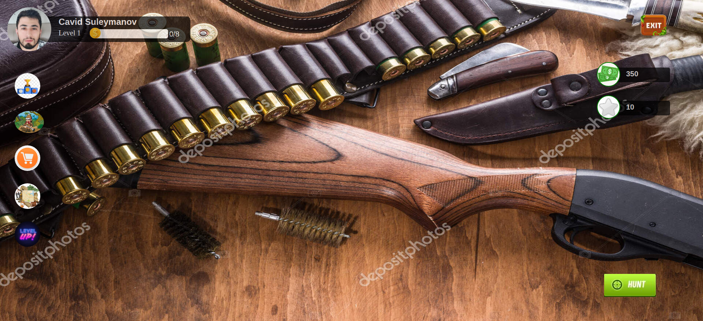
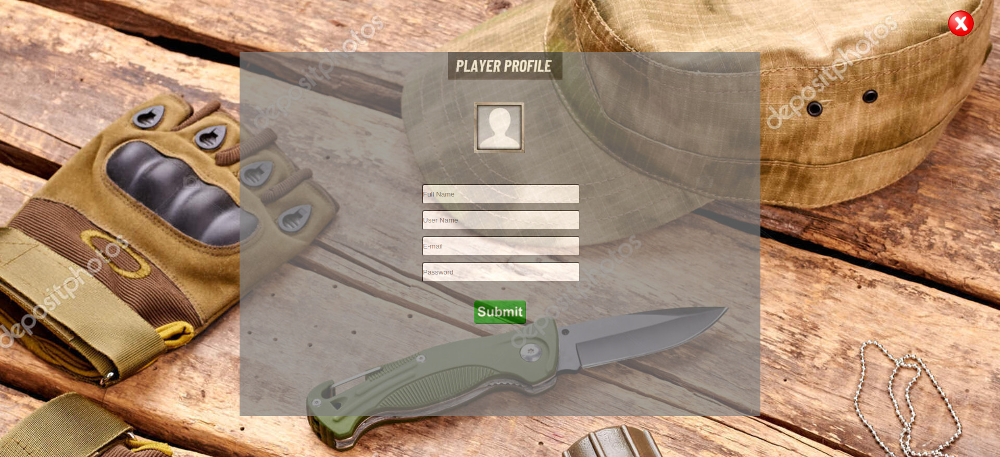
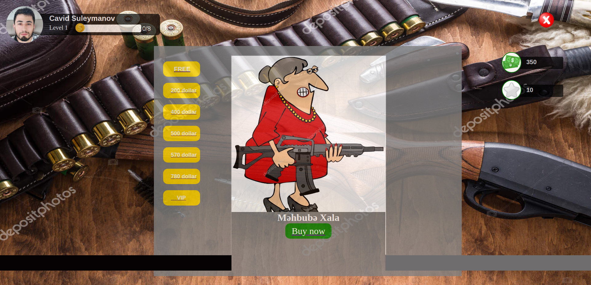
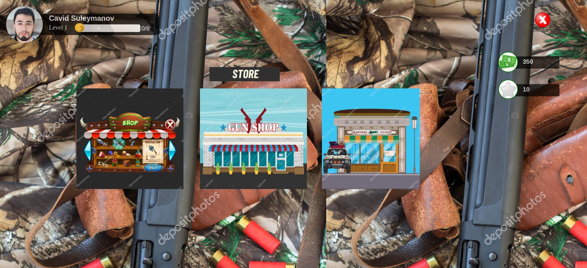
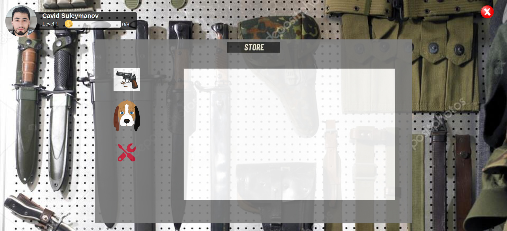
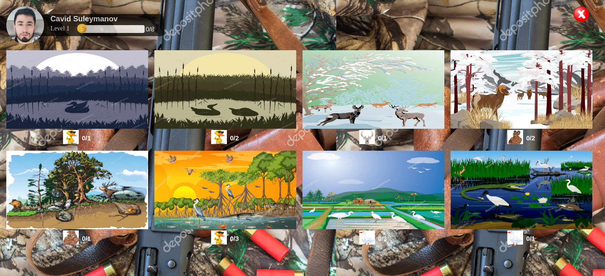
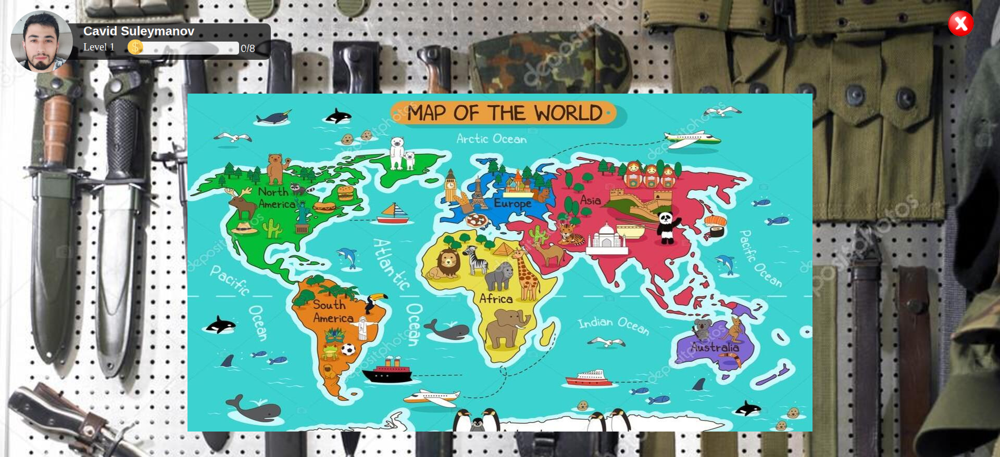
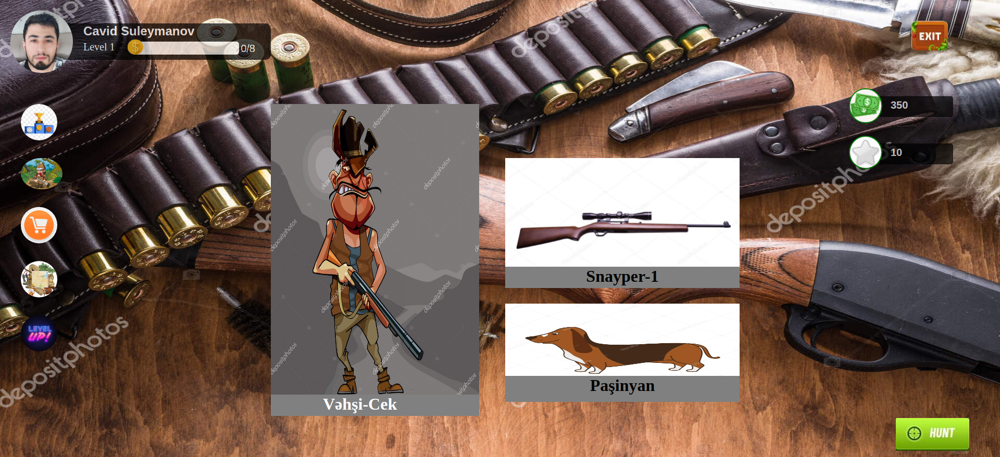
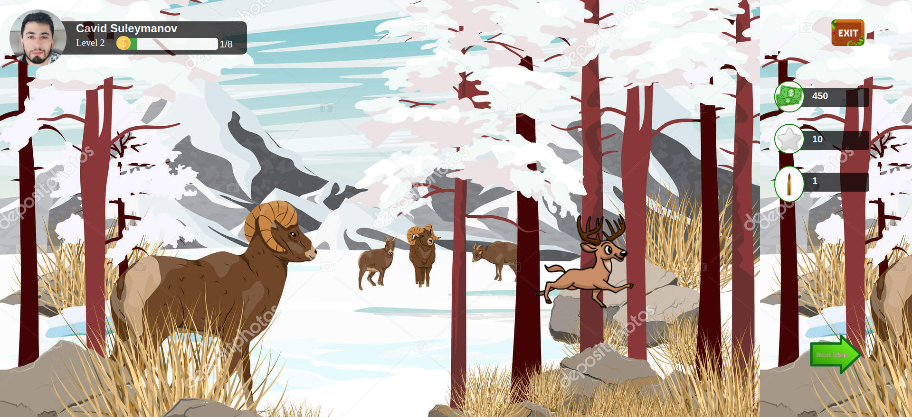
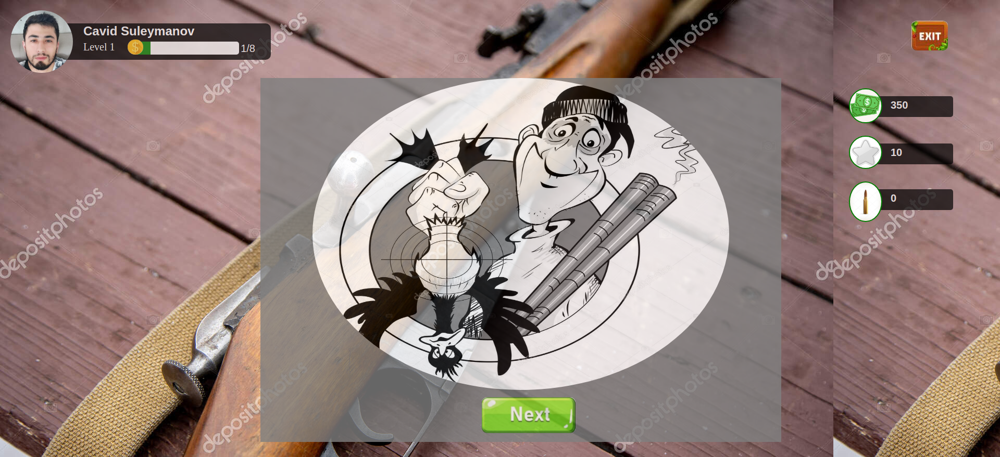

# GITHUB INDICATORS

# THE-HUNTER-GAME

Hi, this time I wrote a simple game using HTML-5 and CSS-3. THE HUNTER GAME
## RULES OF USE

> **STEP-1:** `https://github.com/cavidsuleyman/THE-HUNTER-GAME.git`  
> **STEP-2:**  enter the `THE HUNTER GAME` folder that appears  
> **STEP-3:**  open the folder you are in in a text editor  
> **STEP-4:**  run the `face-page.html` file in the main folder  
> **STEP-5:**  to download the project as `.zip`  [buraya](https://github.com/cavidsuleyman/THE-HUNTER-GAME/archive/refs/heads/master.zip) click edin  

## TEXNOLOGİYA

This project was developed using the following technologies

| No | Technique | Purpose |
| - | ---------- | ----------------------------------- ------------ |
| 1 | HTML | Building a project skeleton |
| 2 | CSS | Make-up of the established skeleton |
| 3 | GIT | Project version control management |
| 4 | VSCode | Text editor used in the project |

## NÜMUNƏ EKRAN GÖRÜNTÜSÜ

